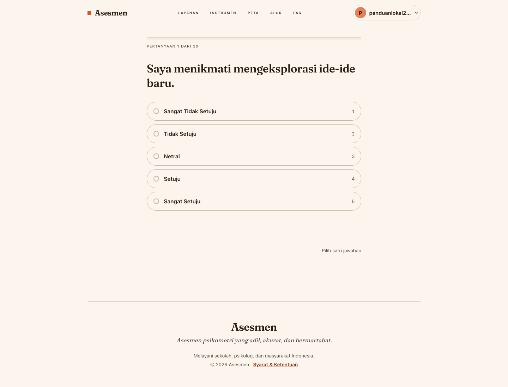
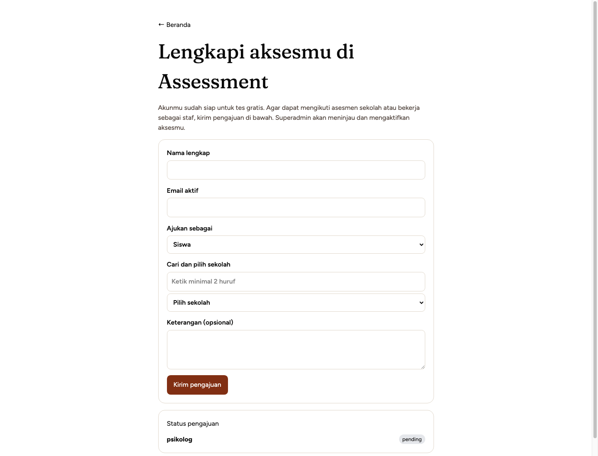

# Panduan Peran

## Pengunjung dan akun baru

Pengunjung dapat membuat akun dan mencoba Tes Kepribadian Gratis. Untuk akses
operasional, akun mengajukan peran melalui halaman onboarding:

- Siswa memilih sekolah.
- Guru BK memilih sekolah, kemudian menunggu persetujuan superadmin.
- Psikolog mengajukan peran tanpa keterikatan sekolah.

### Mencoba Tes Kepribadian Gratis

1. Buat akun melalui halaman **Daftar** dan masuk dengan akun tersebut.
2. Buka menu **Layanan** lalu pilih **Tes Kepribadian Gratis**, atau buka
   `/tes-gratis/soal`.
3. Pilih satu jawaban pada setiap pernyataan skala 1–5. Indikator di atas soal
   menunjukkan kemajuan, misalnya *Pertanyaan 1 dari 30*.
4. Baca hasil sebagai bahan refleksi awal; hasil gratis tidak menggantikan
   asesmen penugasan sekolah maupun penilaian profesional.

*Gambar 3.1. Bukti uji: akun baru berhasil masuk dan menerima pertanyaan Big
Five pertama dari total 30 pertanyaan. Pengujian dilakukan pada lingkungan
lokal agar tidak mengganggu sesi pengguna di layanan publik.*

## Superadmin

Superadmin memeriksa pengajuan akses dan pendaftaran sekolah. Persetujuan role
memaksa pengguna masuk ulang agar sesi memuat kewenangan terbaru. Pendaftaran
sekolah tidak membuat sekolah secara otomatis: record sekolah baru dibuat hanya
setelah disetujui.

### Mengajukan peran operasional

1. Setelah masuk, buka `/onboarding`.
2. Isi nama dan email aktif, lalu pilih **Siswa**, **Guru BK**, atau
   **Psikolog**.
3. Untuk Siswa dan Guru BK, cari lalu pilih sekolah. Psikolog tidak memilih
   sekolah karena cakupan kerjanya tidak dibatasi satu sekolah.
4. Kirim pengajuan dan pantau statusnya pada bagian **Status pengajuan**.
5. Setelah superadmin menyetujui, keluar lalu masuk kembali agar sesi memuat
   peran baru.

*Gambar 3.2. Bukti uji: pengajuan Psikolog berhasil tersimpan dan tampil sebagai
`pending`. Gateway lokal memeriksa sesi ke Auth sebelum meneruskan permintaan,
sehingga tangkapan layar ini juga memverifikasi jalur sesi terlindungi.*

## Guru BK, psikolog, dan siswa

Guru BK hanya melihat siswa dan hasil dalam sekolahnya. Psikolog dapat melihat
hasil sesuai mandat profesional. Siswa hanya melihat data dan hasil dirinya.
Setiap alur yang dimuat dalam versi final panduan harus disertai bukti uji pada
lingkungan yang sesuai. Saat layanan publik sedang digunakan, uji tangkapan
layar dilakukan secara lokal agar tidak mengganggu pengguna aktif.
