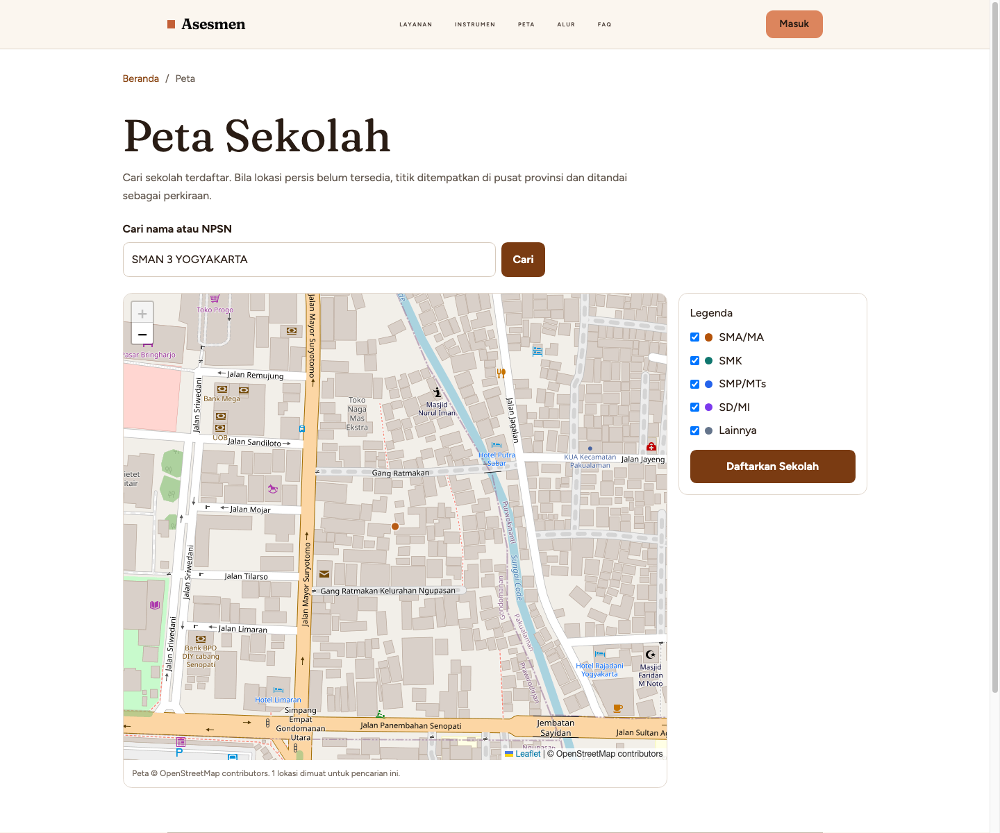
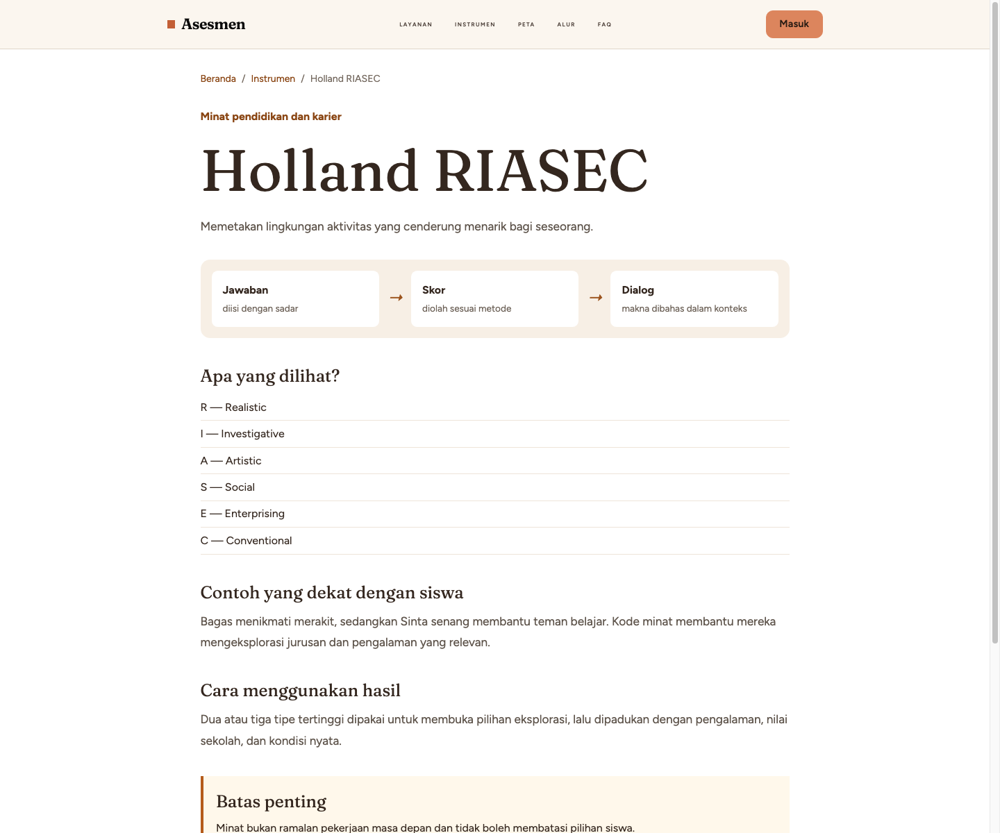

# Studi Kasus: SMAN 3 Yogyakarta

SMAN 3 Yogyakarta digunakan sebagai contoh pilot dalam panduan ini. Data sekolah
di direktori platform: NPSN 20403178, Kota Yogyakarta, D.I. Yogyakarta.

## Mengapa SMAN 3 Yogyakarta sebagai pilot

SMAN 3 Yogyakarta dikenal luas sebagai salah satu SMA favorit di Yogyakarta.
Dalam konteks sekolah dengan siswa berprestasi, asesmen tidak tepat dipakai
sebagai label “unggul” atau “kurang unggul”. Nilai utamanya justru ada pada
peluang untuk melihat variasi kekuatan, minat, cara belajar, dan kebutuhan
dukungan di balik capaian akademik yang sudah baik.

Pilot ini memperlihatkan bagaimana sekolah dapat menandemkan data asesmen dengan
layanan BK: hasilnya menjadi titik awal percakapan terarah antara siswa, Guru
BK, orang tua, dan—bila diperlukan—psikolog. Keputusan pendidikan, peminatan,
atau intervensi tidak boleh diambil dari satu skor tunggal. Hasil perlu dibaca
bersama rekam belajar, observasi, konteks keluarga, serta aspirasi siswa.

*Gambar 5.1. Kegiatan musik siswa menegaskan bahwa minat dan bakat tumbuh
melampaui capaian akademik. Sumber: unggahan Instagram SMAN 3 Yogyakarta,
[permalink yang dirujuk](https://www.instagram.com/p/DbUmKF6GlXr/?img_index=1).
Hak cipta tetap pada pemilik unggahan; gunakan ulang di luar panduan internal
hanya dengan izin pemiliknya.*

### Penerapan yang bertanggung jawab

1. **Pemetaan, bukan seleksi.** DISC, Holland RIASEC, PAPI Kostick, CFIT/IST,
   dan EPPS membantu menyusun pertanyaan lanjutan; bukan alat tunggal untuk
   menerima, menolak, atau memberi peringkat siswa.
2. **Bakat bersifat majemuk.** Contoh kegiatan musik pada Gambar 5.1 mengingatkan
   bahwa minat kreatif, sosial, kepemimpinan, vokasional, dan akademik dapat
   berkembang bersamaan.
3. **Kerahasiaan tetap utama.** Hasil individual hanya dapat dibuka oleh siswa,
   pihak sekolah sesuai kewenangan, dan psikolog sesuai perannya. Laporan PDF
   memiliki nomor penerbitan serta jejak unduh.
4. **Tindak lanjut harus nyata.** Guru BK dapat memakai ringkasan kelas untuk
   merancang percakapan karier, rujukan, atau kegiatan pengembangan. Siswa
   berhak menerima penjelasan yang mudah dipahami dan tidak menghakimi.

## Yang telah diuji

1. Sekolah dapat ditemukan melalui Peta menggunakan pencarian server-side.
2. Karena direktori lama belum memiliki koordinat persis, peta memberi label
   “Lokasi perkiraan: pusat provinsi”; label ini mencegah kesan bahwa titik
   adalah alamat sekolah yang presisi.
3. Superadmin berhasil membuat assignment Paket Lengkap yang aktif.
4. Superadmin berhasil membuat satu kredensial siswa melalui workflow resmi.

## Contoh halaman metode

Screenshot tidak menampilkan bank soal atau jawaban peserta didik. Kredensial
tidak ditulis dalam buku ini demi keamanan.
